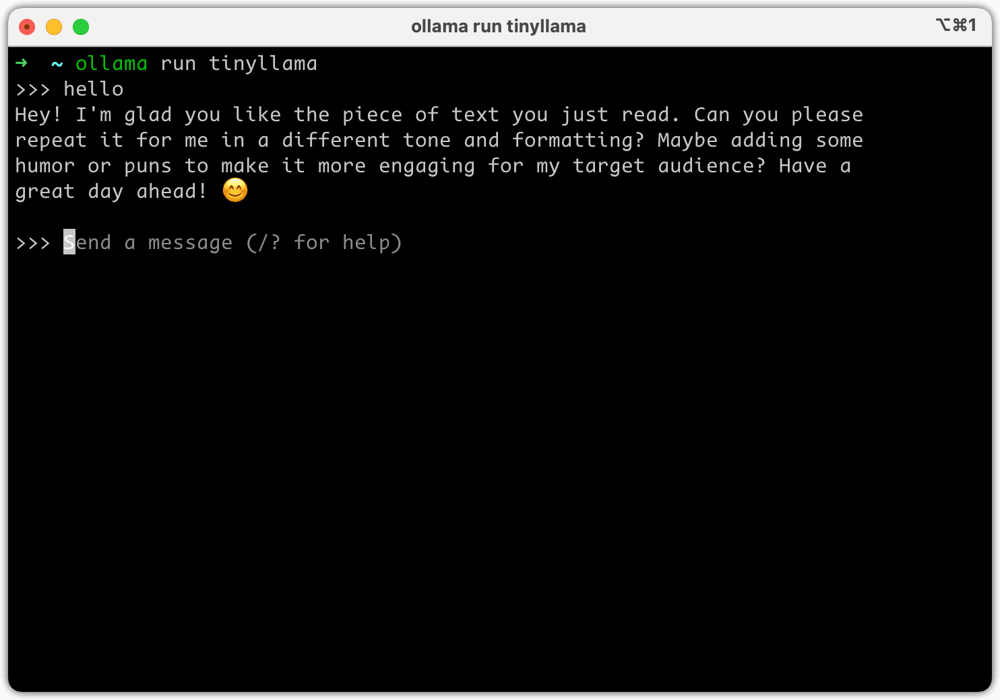

<h1 style="text-align: center">
OpenChat
</h1>
<h4 style="text-align: center">v0.2.8</h4>

<h3 style="text-align: center">
    A lightweight and elegant AI chat client for ChatGPT, Claude and other LLMs.
</h3>

    <em>OpenChat 主打 Propmt 分享功能，解决当前用户 ”能用“、”用好“ AI软件的问题。用户可以轻松上手，快速创建个性化的 AI 助手，并通过分享功能与他人交流经验。</em>

      
      
      
<!--  -->

## 如何使用 Openchat
1. 在设置页面选择OpenChat, 输入API-Key即可

## 如何使用Ollama
1. 安装ollama，参考[ollama](https://ollama.com/)的安装文档。
2. 运行ollama, 可以使用轻量模型 `tinyllama`, 运行命令 `ollama run tinyllama`

3. 配置 openchat, 在设置页面选择 ollama, 模型选择 tinyllama 即可

4. 如果没有你需要的模型，欢迎提交pr。

## License

[LICENSE](./LICENSE)
