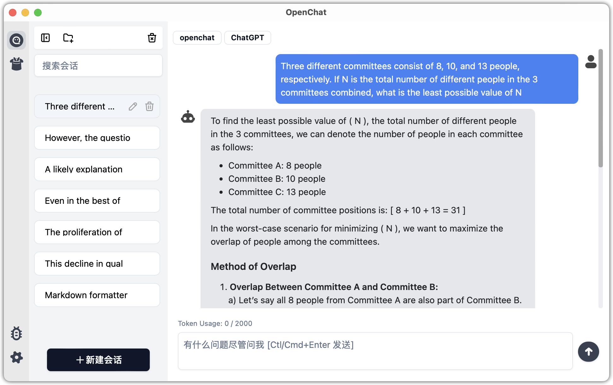
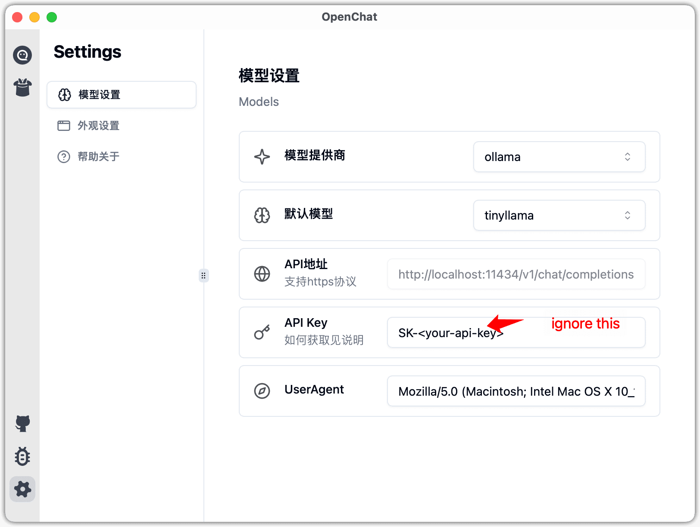

<h1 style="text-align: center">OpenChat</h1>

<h3 style="text-align: center">v0.2.12</h3>

      
      
      <!-- -->
<!--  -->

<h3 style="text-align: center" align="center">
    A Local-First lightweight and elegant AI chat client for ChatGPT and other LLMs.
</h3>

    <em>OpenChat focuses on the Propmt sharing function to solve the current users' problems of "being able to use" and "making good use of" AI software. Users can get started easily, quickly create personalized AI assistants, and exchange experiences with others through the sharing function.</em>

<table cellspacing="0" cellpadding="0" style="border:none">
<tr style="border:none">
<td style="border:none"></td>
<td style="border:none"></td>
</tr>
</table>

## Download

You can download the prebuild binary at [release page](https://github.com/terasum/openchat/releases)

## Usage

1. Open the Settings page (the 'Gear' icon)
2. Select a model provider
3. Input the API Key, and tap the "SAVE" button
4. Switch to Chat page, and go chating with AI!

## How to use with Ollama

1. Installing Ollama，reference to [ollama](https://ollama.com/)
2. Runing Ollama, take `tinyllama` a light weight model as an example, type the command `ollama run tinyllama` as below:

   

3. Configurating OpenChat, select the 'ollama' as the provider, then chose the `tinyllama` model

   

4. If the selection doesn't contains your model, PR is welcome!

## License

[LICENSE](./LICENSE)
